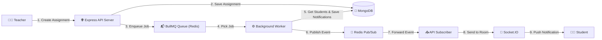

# 🎓 ClassPlus — Real-Time Assignment & Notification Engine

---

## 🚀 Project Overview

**ClassPlus** is an event-driven, scalable classroom management backend built to solve the **notification fan-out bottleneck** when teachers distribute assignments to large numbers of students.

### 📌 The Problem It Solves
In traditional monolithic backends, when a teacher creates an assignment for hundreds or thousands of students:
- Synchronously querying students, creating individual notification records, and sending push alerts inside the HTTP request loop causes **high latency, timeouts, and server crashes**.
- If a downstream service fails during notification dispatch, the entire assignment creation can fail.

### 💡 The Solution
ClassPlus decouples the ingestion of assignments from notification processing using an asynchronous message queue and real-time pub/sub:
1. **Instant Response**: When a teacher publishes an assignment, it is saved to MongoDB and an event is queued into **BullMQ (Redis)**. The API responds to the teacher immediately with HTTP `201 Created` (< 50ms).
2. **Asynchronous Background Processing**: A dedicated background worker consumes the job from BullMQ, queries all assigned students, creates persistent notification records in MongoDB, and broadcasts events via **Redis Pub/Sub**.
3. **Targeted Real-Time Push**: An API subscriber receives the event from Redis Pub/Sub and uses **Socket.IO** to deliver real-time notifications directly to each student's private WebSocket room (`student:<studentId>`).

---

## 1. System Design (HLD)

---

## 2. Process Flowchart

