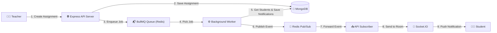
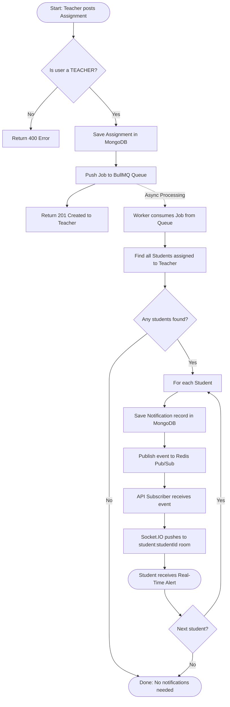

# System Design & Flowchart

## 1.System Design (HLD)

```mermaid
graph LR
    Teacher["👨‍🏫 Teacher"] -->|"1. Create Assignment"| API["🌐 Express API Server"]
    API -->|"2. Save Assignment"| MongoDB[("🍃 MongoDB")]
    API -->|"3. Enqueue Job"| RedisQueue["📬 BullMQ Queue (Redis)"]
    
    RedisQueue -->|"4. Pick Job"| Worker["⚙️ Background Worker"]
    Worker -->|"5. Get Students & Save Notifications"| MongoDB
    Worker -->|"6. Publish Event"| RedisPubSub["📡 Redis Pub/Sub"]
    
    RedisPubSub -->|"7. Forward Event"| APISubscriber["📥 API Subscriber"]
    APISubscriber -->|"8. Send to Room"| SocketServer["🔌 Socket.IO"]
    SocketServer -->|"9. Push Notification"| Student["👨‍🎓 Student"]
```

---

## 2. Process Flowchart

```mermaid
flowchart TD
    Start([Start: Teacher posts Assignment]) --> CheckRole{Is user a TEACHER?}
    
    CheckRole -- No --> Reject[Return 400 Error]
    CheckRole -- Yes --> SaveDB[Save Assignment in MongoDB]
    
    SaveDB --> PushQueue[Push Job to BullMQ Queue]
    PushQueue --> ImmediateResponse[Return 201 Created to Teacher]
    
    PushQueue -. Async Processing .-> WorkerPicks[Worker consumes Job from Queue]
    WorkerPicks --> FindStudents[Find all Students assigned to Teacher]
    
    FindStudents --> CheckList{Any students found?}
    CheckList -- No --> EndJob([Done: No notifications needed])
    
    CheckList -- Yes --> ForEach[For each Student]
    ForEach --> SaveNotif[Save Notification record in MongoDB]
    SaveNotif --> PubEvent[Publish event to Redis Pub/Sub]
    PubEvent --> RecvSub[API Subscriber receives event]
    RecvSub --> PushSocket[Socket.IO pushes to student:studentId room]
    PushSocket --> StudentNotified([Student receives Real-Time Alert])
    StudentNotified --> NextStudent{Next student?}
    NextStudent -- Yes --> ForEach
    NextStudent -- No --> EndJob
```
