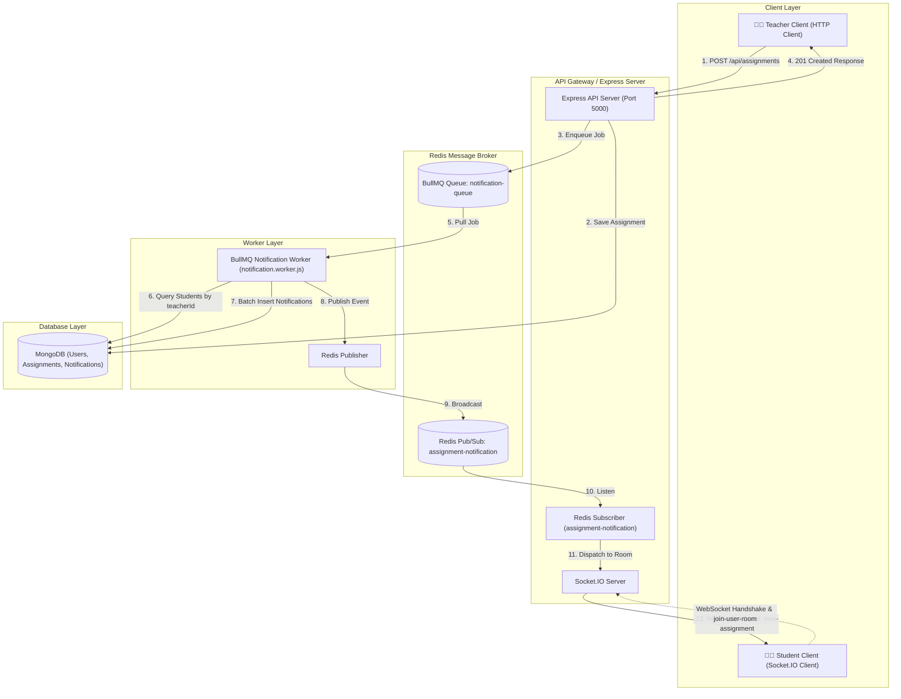
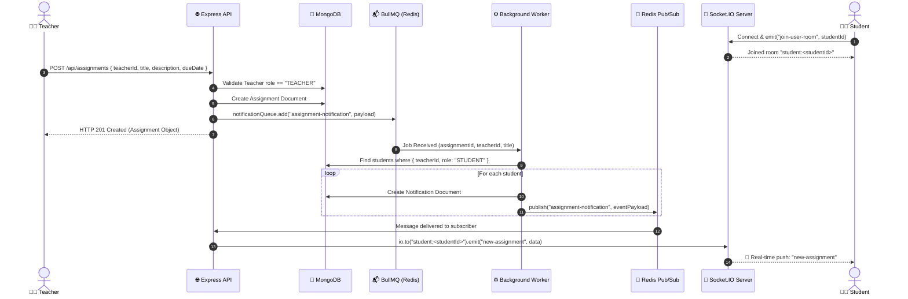
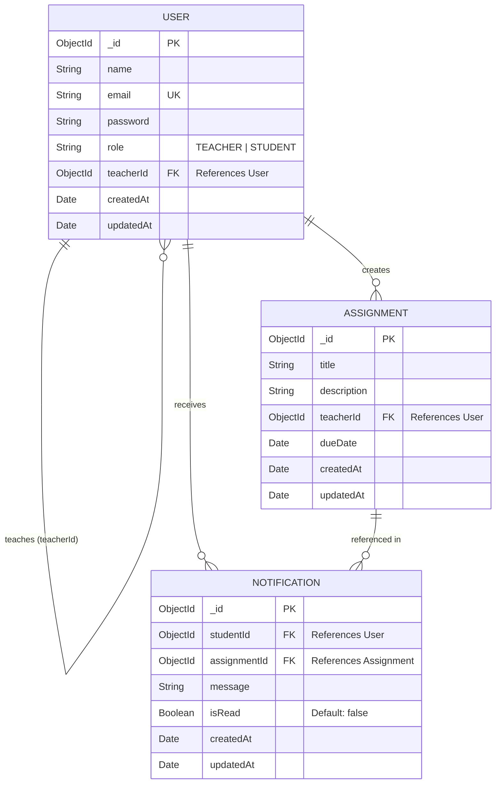

# 🎓 ClassPlus — Real-Time Assignment & Notification Engine

[](https://nodejs.org/)
[](https://expressjs.com/)
[](https://www.mongodb.com/)
[](https://redis.io/)
[](https://bullmq.io/)
[](https://socket.io/)
[](https://www.docker.com/)

An event-driven, scalable classroom management backend engineered to solve the **notification fan-out bottleneck**. Built with **Express 5**, **BullMQ**, **Redis Pub/Sub**, **MongoDB**, and **Socket.IO**, this architecture decouples assignment creation from asynchronous notification persistence and instant WebSocket fan-out delivery.

---

## 📑 Table of Contents

- [Overview](#-overview)
- [System Design & Architecture](#-system-design--architecture)
  - [High-Level Architecture](#high-level-architecture)
  - [Event-Driven Sequence Flow](#event-driven-sequence-flow)
  - [Architectural Components](#architectural-components)
  - [Why This Design?](#why-this-design)
- [Data Models & Schema](#-data-models--schema)
- [API Routes Reference](#-api-routes-reference)
  - [Health Check](#1-health-check)
  - [Auth & User Management](#2-auth--user-management)
  - [Assignment Operations](#3-assignment-operations)
- [Real-Time WebSocket Protocol](#-real-time-websocket-protocol)
- [Tech Stack](#-tech-stack)
- [Project Directory Structure](#-project-directory-structure)
- [Environment Configuration](#-environment-configuration)
- [Getting Started](#-getting-started)
  - [Option 1: Docker Compose (Recommended)](#option-1-docker-compose-recommended)
  - [Option 2: Local Manual Setup](#option-2-local-manual-setup)
- [End-to-End Testing Walkthrough](#-end-to-end-testing-walkthrough)
- [Production Readiness & Next Steps](#-production-readiness--next-steps)

---

## 🚀 Overview

In conventional monolithic classroom systems, when a teacher creates an assignment for hundreds or thousands of enrolled students, performing database inserts and pushing notifications synchronously inside the HTTP request cycle introduces:
- High latency and HTTP timeouts.
- Server memory exhaustion during bulk notification fan-out.
- Cascading failures if downstream notification or delivery services fail.

**ClassPlus solves this by adopting an asynchronous, event-driven pattern:**
1. **Instant Acknowledgement**: Assignment requests are validated and committed to MongoDB; a lightweight job is immediately pushed to a BullMQ queue, responding to the teacher in milliseconds.
2. **Asynchronous Background Processing**: A dedicated worker consumes the queue job, resolves student associations, persists notification documents, and broadcasts to Redis Pub/Sub.
3. **Targeted Real-Time Dispatch**: The API gateway subscriber receives the message and pushes it directly into the targeted student's Socket.IO room.

---

## 🏛 System Design & Architecture

### High-Level Architecture



---

### Event-Driven Sequence Flow



---

### Architectural Components

| Component | Technology | Role & Responsibility |
| :--- | :--- | :--- |
| **API Server** | Node.js / Express 5 | Handles client HTTP authentication, assignment ingestion, health check, and establishes HTTP + Socket.IO servers. |
| **Database** | MongoDB / Mongoose 9 | Durable document storage for users, assignments, and notification audit logs. |
| **Task Queue** | BullMQ + Redis | Manages asynchronous task distribution with durability, concurrency controls, and failure retries. |
| **Worker Process** | Node.js Standalone Worker | Background daemon consuming BullMQ jobs, fanning out queries to find assigned students, creating notification records, and publishing events. |
| **Pub/Sub Bus** | Redis Pub/Sub | Cross-process communication channel distributing notification events back to API nodes running WebSocket servers. |
| **WebSocket Layer** | Socket.IO 4 | Maintains persistent, bidirectional TCP connections to client browsers/apps, partitioned into isolated user rooms (`student:<studentId>`). |

---

### Why This Design?

1. **Zero HTTP Latency Penalties**: Creating an assignment does not block waiting for 5,000 notifications to write or send.
2. **Fault Tolerance & Reliability**: If the WebSocket service or worker temporarily hiccups, tasks remain queued in Redis without dropping teacher submissions.
3. **Independent Horizontal Scalability**:
   - API servers can be horizontally scaled behind a load balancer.
   - Workers can be scaled up or down independently depending on queue pressure.
4. **Targeted Delivery (Room-based Pub/Sub)**: Socket.io rooms (`student:<id>`) ensure students only receive events intended for their specific profile, preserving bandwidth and security.

---

## 🗄 Data Models & Schema



---

## 🛣 API Routes Reference

Base URL: `http://localhost:5000`

### 1. Health Check

#### `GET /`
Verifies server health and connectivity status.

- **Response `200 OK`**:
```json
{
  "message": "ClassPlus Backend is running"
}
```

---

### 2. Auth & User Management

#### `POST /api/auth/create-user`
Registers a new user into the platform as either a `TEACHER` or a `STUDENT`.

- **Headers**: `Content-Type: application/json`
- **Request Body**:
```json
{
  "name": "Prof. Alan Turing",
  "email": "turing@classplus.com",
  "password": "securepassword123",
  "role": "TEACHER"
}
```
> Note: `role` must strictly be `"TEACHER"` or `"STUDENT"`.

- **Success Response `201 Created`**:
```json
{
  "message": "TEACHER created successfully",
  "user": {
    "_id": "6741b2c488b0f443b23e8111",
    "name": "Prof. Alan Turing",
    "email": "turing@classplus.com",
    "role": "TEACHER",
    "teacherId": null,
    "createdAt": "2026-09-22T09:00:00.000Z",
    "updatedAt": "2026-09-22T09:00:00.000Z"
  }
}
```

- **Error Responses**:
  - `400 Bad Request`: Missing mandatory fields or invalid role.
  - `409 Conflict`: User with the provided email already exists.
  - `500 Internal Server Error`: Server processing error.

---

#### `POST /api/auth/assign-student`
Maps an existing student to an assigned teacher. Used by the worker to determine which students receive notifications when that teacher posts an assignment.

- **Headers**: `Content-Type: application/json`
- **Request Body**:
```json
{
  "teacherId": "6741b2c488b0f443b23e8111",
  "studentId": "6741b31288b0f443b23e8222"
}
```

- **Success Response `200 OK`**:
```json
{
  "message": "Student assigned successfully",
  "student": {
    "id": "6741b31288b0f443b23e8222",
    "name": "John Doe",
    "teacherId": "6741b2c488b0f443b23e8111"
  }
}
```

- **Error Responses**:
  - `400 Bad Request`: Missing `teacherId` or `studentId`.
  - `404 Not Found`: Either teacher not found (or not role `TEACHER`) or student not found (or not role `STUDENT`).
  - `500 Internal Server Error`: Server failure.

---

### 3. Assignment Operations

#### `POST /api/assignments`
Enables a teacher to publish a new assignment. Atomically persists the assignment and triggers the background notification pipeline via BullMQ.

- **Headers**: `Content-Type: application/json`
- **Request Body**:
```json
{
  "teacherId": "6741b2c488b0f443b23e8111",
  "title": "Data Structures Assignment #3: Red-Black Trees",
  "description": "Implement insertion and self-balancing routines in C++ or Java.",
  "dueDate": "2026-10-15T23:59:59.000Z"
}
```

- **Success Response `201 Created`**:
```json
{
  "message": "Assignment created successfully",
  "assignment": {
    "_id": "6741b4fe88b0f443b23e8333",
    "title": "Data Structures Assignment #3: Red-Black Trees",
    "description": "Implement insertion and self-balancing routines in C++ or Java.",
    "teacherId": "6741b2c488b0f443b23e8111",
    "dueDate": "2026-10-15T23:59:59.000Z",
    "createdAt": "2026-09-22T09:15:00.000Z",
    "updatedAt": "2026-09-22T09:15:00.000Z"
  }
}
```

- **Error Responses**:
  - `400 Bad Request`: User submitting is not a `TEACHER`.
  - `404 Not Found`: Specified `teacherId` does not exist.
  - `500 Internal Server Error`: Server failure during creation or queue enqueue.

---

## 🔌 Real-Time WebSocket Protocol

ClassPlus utilizes **Socket.IO** to deliver push notifications with minimal latency.

### 1. Connection & Room Registration
When a student logs in or opens the client application:
1. Connects to `ws://localhost:5000`.
2. Emits `join-user-room` with their `studentId`.
3. Server registers the socket into room `student:<studentId>`.

```javascript
// Client-side subscription example
const socket = io("http://localhost:5000");

socket.on("connect", () => {
    console.log("Connected to server:", socket.id);
    socket.emit("join-user-room", "<STUDENT_USER_ID>");
});
```

### 2. Inbound Notification Event (`new-assignment`)
When a teacher publishes an assignment, all mapped students receive the following payload on the `new-assignment` channel:

```json
{
  "notificationId": "6741b52088b0f443b23e8444",
  "studentId": "6741b31288b0f443b23e8222",
  "assignmentId": "6741b4fe88b0f443b23e8333",
  "message": "New assignment: Data Structures Assignment #3: Red-Black Trees"
}
```

```javascript
socket.on("new-assignment", (data) => {
    console.log("🔔 New Assignment Notification Received:", data);
});
```

---

## 🛠 Tech Stack

| Domain | Library / Tool | Description |
| :--- | :--- | :--- |
| **Runtime** | Node.js (v18+) | JavaScript server runtime environment |
| **Framework** | Express.js (v5.2.1) | Fast, unopinionated web routing framework |
| **Database** | MongoDB / Mongoose (v9.10.1) | Document-oriented NoSQL database & ODM |
| **Caching & Message Broker** | Redis (v7+) | In-memory key-value store, task queue & pub/sub broker |
| **Task Queue** | BullMQ (v6.3.6) | Distributed job queue on top of Redis |
| **WebSockets** | Socket.IO (v4.8.3) | Real-time bidirectional event-based communication |
| **Containerization** | Docker & Docker Compose | Multi-container environment orchestration |

---

## 📁 Project Directory Structure

```text
classPlus/
├── bullmq/
│   ├── notification.queue.js       # BullMQ queue producer definition
│   ├── notification.subscriber.js  # Redis Pub/Sub subscriber routing to Socket.IO
│   └── notification.worker.js      # Background job consumer & fan-out processor
├── config/
│   └── db.js                       # MongoDB Mongoose connection handler
├── controllers/
│   ├── assignment.controller.js    # Assignment business logic & queue dispatcher
│   └── auth.controller.js          # User registration & student-teacher mapping
├── models/
│   ├── assignment.model.js         # Mongoose schema for assignments
│   ├── notification.model.js       # Mongoose schema for notifications
│   └── user.model.js               # Mongoose schema for users & roles
├── routes/
│   ├── assignment.routes.js        # /api/assignments routing definition
│   └── auth.routes.js              # /api/auth routing definition
├── .dockerignore                   # Docker build ignore rules
├── .env                            # Environment configuration (see sample below)
├── docker-compose.yml              # Multi-container orchestration (API, Worker, Redis, Mongo)
├── Dockerfile                      # Node.js application container blueprint
├── package.json                    # Dependencies and scripts
├── publisher.js                    # Redis publisher client instance
├── redis.js                        # General Redis client connection
├── server.js                       # Application entrypoint & HTTP server
├── socket-client.js                # Testing script for Socket.IO student client
├── socket.js                       # Socket.IO initialization & room manager
├── subscriber.js                   # Redis subscriber client instance
└── testpubsub.js                   # Standalone test script for Redis pub/sub verification
```

---

## ⚙️ Environment Configuration

Create a `.env` file in the root directory:

```env
PORT=5000
MONGO_URI=mongodb://localhost:27017/classplus
REDIS_HOST=localhost
REDIS_URL=redis://localhost:6379
```

> **Note for Docker:** When running with Docker Compose, `REDIS_HOST` and `REDIS_URL` will target the container names `redis` and `mongo` defined in `docker-compose.yml`.

---

## 🏁 Getting Started

### Option 1: Docker Compose (Recommended)

Run the entire cluster (API server, Background Worker, Redis, and MongoDB) with a single command:

```bash
docker compose up --build
```

Services launched:
- **API Server:** `http://localhost:5000`
- **Worker:** Continuous background container processing `notification-queue`
- **Redis:** `localhost:6379`
- **MongoDB:** `localhost:27017`

To shut down:
```bash
docker compose down
```

---

### Option 2: Local Manual Setup

#### 1. Prerequisites
Ensure you have installed:
- [Node.js](https://nodejs.org/) (v18+)
- [Redis](https://redis.io/download/) running on port `6379`
- [MongoDB](https://www.mongodb.com/try/download/community) running on port `27017`

#### 2. Install Dependencies
```bash
npm install
```

#### 3. Start the API Server
```bash
npm run dev
# or
npm start
```

#### 4. Start the Notification Worker in a Separate Terminal
```bash
node bullmq/notification.worker.js
```

---

## 🧪 End-to-End Testing Walkthrough

Follow these steps using cURL, Postman, or ThunderClient:

### Step 1: Create a Teacher
```bash
curl -X POST http://localhost:5000/api/auth/create-user \
  -H "Content-Type: application/json" \
  -d '{
    "name": "Dr. Sarah Connor",
    "email": "sarah@classplus.com",
    "password": "password123",
    "role": "TEACHER"
  }'
```
*Note the returned `_id` as `TEACHER_ID`.*

---

### Step 2: Create a Student
```bash
curl -X POST http://localhost:5000/api/auth/create-user \
  -H "Content-Type: application/json" \
  -d '{
    "name": "John Connor",
    "email": "john@classplus.com",
    "password": "password123",
    "role": "STUDENT"
  }'
```
*Note the returned `_id` as `STUDENT_ID`.*

---

### Step 3: Assign the Student to the Teacher
```bash
curl -X POST http://localhost:5000/api/auth/assign-student \
  -H "Content-Type: application/json" \
  -d '{
    "teacherId": "<TEACHER_ID>",
    "studentId": "<STUDENT_ID>"
  }'
```

---

### Step 4: Launch the WebSocket Test Client
Update the `studentId` in `socket-client.js` with your `STUDENT_ID`, then run:
```bash
node socket-client.js
```
*Output will indicate connection to the server and joining `student:<STUDENT_ID>`.*

---

### Step 5: Post an Assignment
```bash
curl -X POST http://localhost:5000/api/assignments \
  -H "Content-Type: application/json" \
  -d '{
    "teacherId": "<TEACHER_ID>",
    "title": "Physics Quiz 1: Mechanics",
    "description": "Complete chapters 1 to 3 problems.",
    "dueDate": "2026-10-01T23:59:59.000Z"
  }'
```

### Result:
1. HTTP responds immediately (`201 Created`).
2. The worker logs:
   ```text
   Processing job <job_id>
   Found 1 students
   Notification published for John Connor
   Job <job_id> completed
   ```
3. The `socket-client.js` terminal instantly displays:
   ```text
   🔔 NEW ASSIGNMENT!
   {
     notificationId: '...',
     studentId: '...',
     assignmentId: '...',
     message: 'New assignment: Physics Quiz 1: Mechanics'
   }
   ```

---

## 📈 Production Readiness & Next Steps

For production enterprise deployment, consider the following enhancements:
- **Socket.IO Redis Adapter**: Replace default in-memory socket adapter with `@socket.io/redis-adapter` to enable multiple horizontally-scaled API gateway nodes.
- **JWT Authentication & Middleware**: Add route protection and extract `req.user.id` from tokens rather than accepting user IDs in body payloads.
- **Worker Batching & Concurrency**: Tune BullMQ worker concurrency (`{ concurrency: 10 }`) and use MongoDB `insertMany()` for large student cohorts.
- **Compound Database Indexes**: Add `{ teacherId: 1, role: 1 }` index on the `User` collection for high-speed student queries.
- **Dead Letter Queue (DLQ)**: Configure BullMQ retries and failed job persistence for audit and alert capabilities.

---

## 📄 License
This project is licensed under the **ISC License**.
